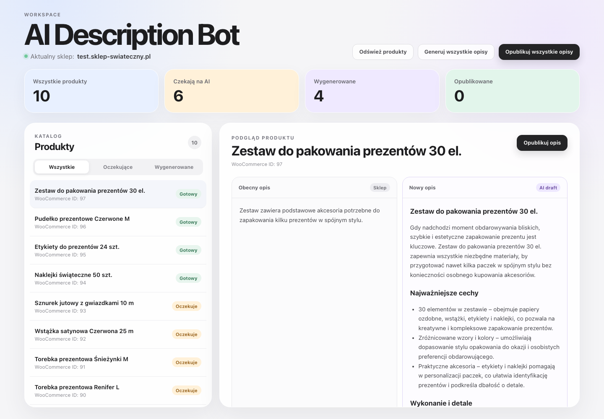

# AI Description Bot

Aplikacja do zarządzania generowaniem i publikowaniem opisów produktów w sklepie WooCommerce.



## O projekcie

Pierwsza wersja aplikacji powstała w odpowiedzi na realny problem: około 6000 produktów w sklepie `sklep-swiateczny.pl` miało bardzo słabe lub niepełne opisy. Początkowo był to prosty skrypt JavaScript uruchamiany wyłącznie w terminalu.

Aktualna wersja została rozbudowana z myślą o osobach, które nie czują się swobodnie z narzędziami technicznymi. Aplikacja ma interfejs webowy, lokalne API, trwałą kolejkę opartą na SQLite oraz statusy pozwalające kontrolować cały proces. Backend został przeniesiony z JavaScriptu do TypeScriptu.

Projekt pozwala przejść przez pełny proces:

```text
WooCommerce → import produktów → SQLite → generowanie opisów przez AI
→ podgląd starego i nowego opisu → publikacja do WooCommerce
```

## Główne funkcje

- pobieranie produktów z WooCommerce REST API,
- zapisywanie produktów w lokalnej bazie SQLite,
- rozróżnianie produktów według sklepu i identyfikatora WooCommerce,
- pomijanie duplikatów podczas ponownego importu,
- masowe generowanie opisów i krótkich opisów,
- przechowywanie starej oraz wygenerowanej wersji opisu,
- statusy generowania i publikacji,
- zapis błędów i liczby ponowień,
- porównanie starego i nowego opisu w interfejsie,
- masowa publikacja gotowych opisów do WooCommerce,
- filtrowanie produktów według statusu.

## Technologie

- React i Vite,
- Node.js i Express,
- TypeScript,
- SQLite oraz `better-sqlite3`,
- WooCommerce REST API,
- OpenAI API.

## Statusy procesu

Generowanie opisów wykorzystuje statusy:

- `queued` – produkt czeka w kolejce,
- `processing` – opis jest generowany,
- `generated` – nowy opis został zapisany,
- `failed` – generowanie zakończyło się błędem.

Publikowanie wykorzystuje statusy:

- `draft` – opis nie został jeszcze opublikowany,
- `queued` – opis oczekuje na publikację,
- `publishing` – trwa wysyłanie do WooCommerce,
- `published` – opis został opublikowany,
- `failed` – publikacja zakończyła się błędem.

## Wymagania

- Node.js 22 lub nowszy,
- npm,
- sklep WooCommerce z włączonym REST API,
- klucze WooCommerce z odpowiednimi uprawnieniami,
- klucz OpenAI API.

## Konfiguracja

W katalogu nadrzędnym względem aplikacji utwórz plik `.env`:

```env
SHOP_ID=sklep-swiateczny
WPAPI_URL=https://twoj-sklep.pl/wp-json/wc/v3/products
WC_CONSUMER_KEY=ck_...
WC_CONSUMER_SECRET=cs_...
OPENAI_API_KEY=sk_...
```

`SHOP_ID` jest wewnętrznym, stabilnym identyfikatorem sklepu. Para `SHOP_ID + wp_product_id` jednoznacznie identyfikuje produkt w bazie.

Nie commituj pliku `.env` ani prawdziwych kluczy API do repozytorium.

## Instalacja

Przejdź do katalogu aplikacji i zainstaluj zależności:

```bash
cd bot-opis
npm install
```

Przy pierwszym uruchomieniu plik `src/database/app.db` i tabela `products` zostaną utworzone automatycznie na podstawie `src/database/init.sql`.

## Uruchomienie lokalne

Aplikacja wymaga równoczesnego uruchomienia API i frontendu.

### 1. Backend i lokalne API

W pierwszym terminalu:

```bash
cd bot-opis
npm run api
```

API działa pod adresem:

```text
http://localhost:3000
```

Lista produktów jest dostępna pod:

```text
http://localhost:3000/api/products
```

### 2. Frontend

W drugim terminalu:

```bash
cd bot-opis
npm run dev
```

Interfejs działa domyślnie pod adresem:

```text
http://localhost:5173
```

Vite przekazuje zapytania zaczynające się od `/api` do backendu działającego na porcie `3000`.

## Obsługa z interfejsu

W górnej części aplikacji znajdują się trzy główne akcje:

1. **Odśwież produkty** – pobiera produkty z WooCommerce i zapisuje nowe rekordy w SQLite.
2. **Generuj wszystkie opisy** – przetwarza wszystkie produkty ze statusem `queued` i zapisuje odpowiedzi AI.
3. **Opublikuj wszystkie opisy** – wysyła wszystkie gotowe opisy dla aktualnego `SHOP_ID` do WooCommerce.

Po zakończeniu każdej operacji frontend ponownie pobiera aktualne produkty z lokalnej bazy.

## Endpointy API

| Metoda | Endpoint | Działanie |
| --- | --- | --- |
| `GET` | `/api/products` | Pobiera produkty zapisane w SQLite |
| `POST` | `/api/refresh` | Importuje nowe produkty z WooCommerce |
| `POST` | `/api/descriptions/generate-all` | Generuje opisy dla produktów oczekujących w kolejce |
| `POST` | `/api/descriptions/publish-all` | Publikuje wszystkie gotowe opisy dla aktualnego sklepu |

## Uruchamianie procesów z terminala

Te same główne procesy można uruchomić bez interfejsu:

```bash
npm run crawl:products
npm run generate:descriptions
npm run publish:descriptions
```

Pozostałe komendy:

```bash
npm run lint
npm run build
npm run preview
```

## Struktura projektu

```text
src/
├── backend/
│   ├── AI/              # generowanie opisów i prompt
│   ├── api/             # lokalne API Express
│   ├── crawler/         # import produktów z WooCommerce
│   └── updateProducts/  # publikowanie opisów
├── database/            # konfiguracja SQLite i schemat tabeli
└── frontend/            # interfejs React
```

## Dalszy rozwój

W kolejnych wersjach planuję dodać generowanie i publikowanie opisów pojedynczych produktów. Obecnie główne operacje działają zbiorczo i obejmują wszystkie produkty spełniające warunki danego etapu procesu.

Największym wyzwaniem projektu pozostaje skalowanie generowania treści. Pierwsza wersja miała przede wszystkim szybko zautomatyzować pracę z dużą liczbą produktów, dlatego ma dwa istotne ograniczenia:

1. Brakuje możliwości przekazania uwag i ponownego wygenerowania wybranego opisu na ich podstawie.
2. Model nie porównuje nowej treści z opisami wygenerowanymi wcześniej dla innych produktów. Przy dużym katalogu może to prowadzić do powtarzalnych konstrukcji, argumentów lub fragmentów tekstu.

Planowany rozwój obejmuje więc:

- generowanie i publikowanie pojedynczego produktu,
- możliwość poprawiania opisów na podstawie uwag użytkownika,
- wersjonowanie wygenerowanych treści,
- porównywanie nowych opisów z wcześniejszymi wynikami,
- wykrywanie podobieństw i ograniczanie powtórzeń w dużych katalogach,
- lepszą kontrolę kolejki, ponowień i wznowienia procesu po restarcie aplikacji.

## Bezpieczeństwo

Aplikacja jest obecnie przeznaczona do uruchamiania lokalnego. Dane dostępowe pozostają w lokalnym pliku `.env`, a frontend komunikuje się z zewnętrznymi API wyłącznie przez backend. Przed publikacją opisów warto zweryfikować wygenerowaną treść w panelu aplikacji.
